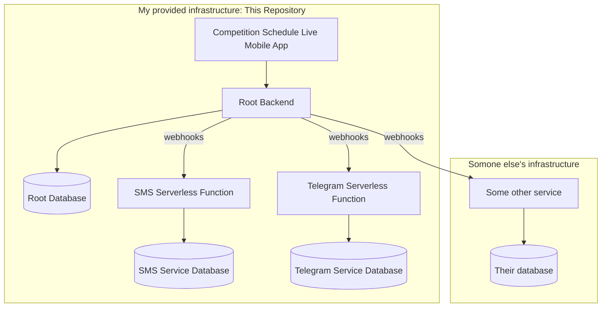

# competition-schedule-live

Bundle of apps and services that manages a WCA Competition schedule live

## packages

### `packages/server`

This is the main beast that drives events. It is a nodejs, express, graphql server. It handles authentication as well as real time tracking of the ongoing activity. Clients will receive a JWT token when they authenticate which can then be used across these other services to verify their identity. When a competition owner imports a competition, it saves a subset of data to a database. The list of competition owners is also saved and will be able to be edited in the future. After a competition owner has imported a competition, any client (authenticated or not), can "subscribe" to the activity events to listen for activities starting and stopping. This server also sends webhooks when an activity is started and these can be configured however the competition owner chooses.

Bundled also in this monorepo will be serverless applications that listen for these webhooks and do actions such as send SMS messages, send discord messages, send telegram messages, or more

A spec for the webhooks will be well communicated once finalized so that anyone can create these serverless applications.

- [Database schema](./packages/server/prisma/schema.prisma)
- [Graphql schema](./packages/server/graphql/schema)

The question should be asked: How does the server know who is in what group? The main answer to this is through the [WCIF](https://github.com/thewca/wcif/blob/master/specification.md). But the other question is does this data get saved?
**An argument for saving the data in databases**: potentially faster, could cache, only retreive the data you need.
**Arguments for not saving it**: If changes are made, removes the need to reimport a competition.

Now, a "webhook" application could manage this problem on it's own. We can send as little as just the competitionId and the activityId to a webhook application, and it should be able to look up in it's own cache or retreive the WCIF to determine who is in the group. This offloads resources from the main server onto all of the consumer ones. For ones I prebuild, this could be just fine if they all reuse the same database tables. A webhook application would likely already need a database to keep track of wca users and their communication channel identifiers.
Alternatively: The main server can cache this information and have a standarized method to communicate the competitionId, list of people and their assignments to the webhook server and the webhook server wouldn't need to lookup much more. The webhook server can also be a consumer of the graphql api to ask for a specific subset of information of the competition when needed thus avoiding consuming too much of the WCA website's resources.
I leave this problem still unsolved.

### `packages/webapp`

This is the main app that competition owners will interact with. This is a material-UI app that talks directly to the main server (packages/server)

### `packages/notifapi`

This is the service that handles text notifications to individual people. Users sign up via a frontend and it saves the data here.

This service is pinged from the core server to send the notifications.

### `packages/www`

This is the main frontend that users interact with to sign up for notifications. This site is very simple and just helps with competition discovery, authenticating user's phone numbers, and gives users a way to sign up for competitors as well as additional activities.

### `packages/admin`

This is the UI I interact with to setup competitions.

## Glossary

- `competition owner`: A delegate or organizer
- `stage manager`: A delegate, organizer, or authorized individual who is allowed to progress the activities in this service
- `Activity`: Per the [WCIF spec](https://github.com/thewca/wcif/blob/master/specification.md), an activity is a very flexible concept. It is a recursive data structure that makes up a schedule. It represents all of the rounds you see on the schedule but also "lunch", "awards" and so on. Activities also have childActivities. Round activities will children in the form of "groups". To break it down further, "group" activities could have attempts. Only FMC or Multi-blind need attempt activities however.
- `JWT`: JSON web token

## Roadmap

- [ ] Competition owners can track the current ongoing group for a respective stage
- [ ] Users can get notified of their groups in real time via SMS messages
- [ ] Competition owners can reflect on the performance of their comp schedule through looking at the activity history
- [ ] Competition owners can update the WCA schedule based on the actual performance of the comp schedule.

# Overview



## Getting Started

This repository is managed with **Yarn workspaces** and **Lerna**. You will need
Node.js 16 (see `.nvmrc`) and Yarn 1 installed.

1. Install dependencies and bootstrap all packages:
   ```bash
   yarn install
   ```
2. Start the databases required by the services:
   ```bash
   docker-compose up -d
   ```
   This launches `api` on port `5432` and `notifapi` on port `5433`.
3. Run every package in development mode:
   ```bash
   yarn dev
   ```
   Individual apps can be started with `yarn dev:webapp`, `yarn dev:www`,
   `yarn dev:projector` and `yarn dev:admin`.
4. Copy the sample environment files when present. For example the webapp has
   `src/.env.development.local.sample` which should be copied to
   `src/.env.development.local`.

The GraphQL API will be available on port `8080` once the server package starts
and Vite will launch the frontend apps on their respective ports.

## Contributing

Formatting is handled by **Prettier** and the pre-commit hook runs
`lerna run lint`. Before opening a pull request run:

```bash
npx lerna run lint
```

Feel free to open issues or pull requests against the `main` branch once your
changes are tested locally.
